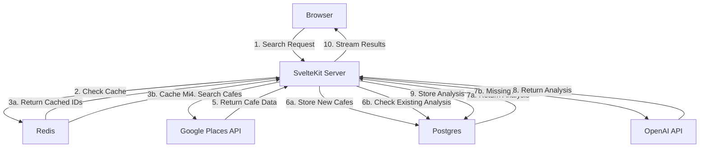
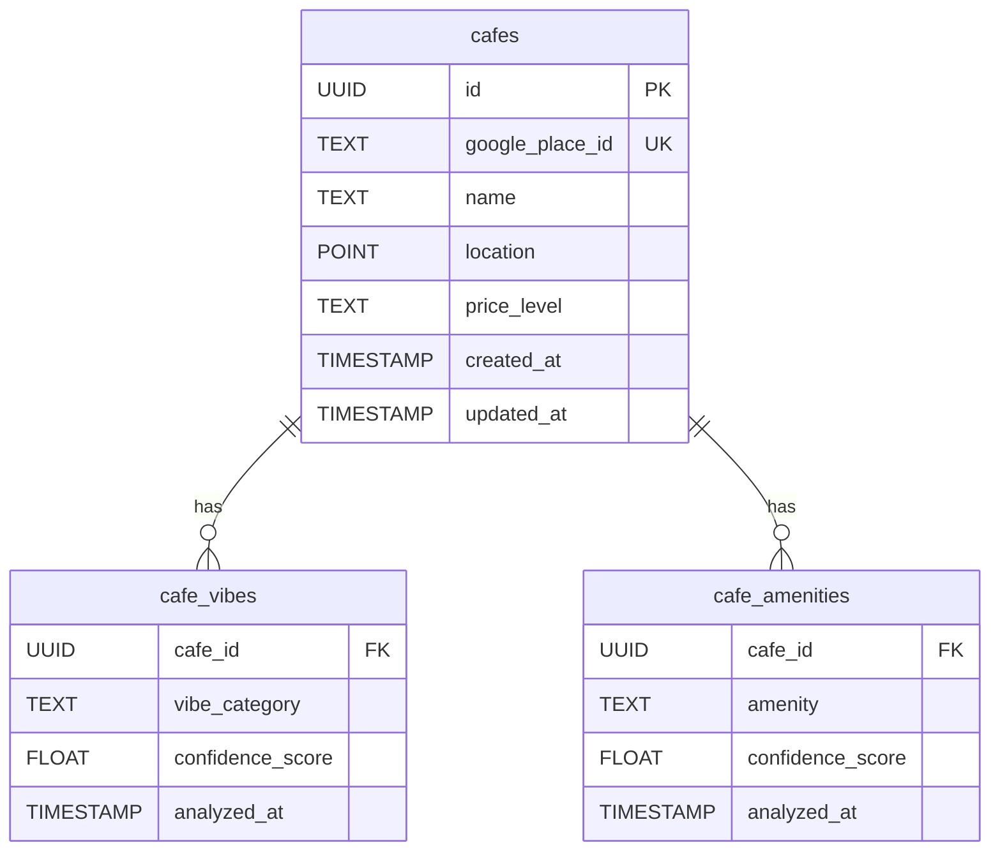

# QuickCafé

<div align="center">

An AI-powered café recommendation engine that finds your perfect café based on mood, preferences, and location.

</div>

---

## 📚 Table of Contents
- [About](#-about)
- [Features](#-features)
- [Tech Stack](#-tech-stack)
- [Getting Started](#-getting-started)
- [Architecture](#-architecture)
- [API Documentation](#-api-documentation)
- [Roadmap](#-roadmap)
- [Contributing](#-contributing)
- [License](#-license)

## 🎯 About

QuickCafé revolutionizes how you find the perfect café. Using AI, we analyze café reviews and data to understand the true vibe and amenities of each location, helping you find exactly what you're looking for.

### The Problem
Finding the right café isn't just about location - it's about finding a space that matches your mood and needs. Traditional review platforms don't capture the "vibe" or specific amenities you're looking for.

### Our Solution
QuickCafé uses AI to:
- Analyze thousands of reviews to understand café vibes
- Score cafes on specific amenities and features
- Match your mood and requirements to the perfect spot
- Provide real-time, personalized recommendations

## ✨ Features

### Current Features

#### 🎯 Smart Search
- Location-based café discovery
- Mood-based filtering (cozy, modern, quiet, lively, artistic, traditional, industrial)
- Amenity requirements (wifi, outdoor seating, power outlets, etc.)
- Price range filtering

#### 🤖 AI Analysis
- Review analysis for vibe detection
- Amenity confidence scoring
- Intelligent matching algorithm
- Real-time result streaming

#### ⚡ Performance
- Location-based caching
- Batch processing for analysis
- Coordinate rounding for cache optimization
- Streaming responses for better UX

### Core Functionality

#### 1. Vibe Detection
```typescript
type Vibe = 
  | "cozy"      // Warm, comfortable atmosphere
  | "modern"    // Contemporary design and feel
  | "quiet"     // Low noise, good for focus
  | "lively"    // Energetic, social atmosphere
  | "artistic"  // Creative, unique space
  | "traditional" // Classic café experience
  | "industrial" // Warehouse/modern industrial design
```

#### 2. Amenity Scoring
```typescript
type Amenity = 
  | "wifi"              // Internet connectivity
  | "outdoor_seating"   // Outdoor space
  | "power_outlets"     // Charging availability
  | "pet_friendly"      // Allows pets
  | "parking"           // Parking availability
  | "workspace_friendly" // Good for working
  | "food_menu"         // Food options
```

## 🛠 Tech Stack

- **Frontend**: SvelteKit, TailwindCSS
- **Backend**: SvelteKit (Server-side)
- **Database**: Supabase (PostgreSQL)
- **Caching**: Upstash Redis
- **AI/ML**: OpenAI GPT-4
- **APIs**: Google Places API

## 🚀 Getting Started

### Prerequisites
- Node.js 18+
- npm/pnpm
- Google Places API key
- OpenAI API key
- Upstash Redis account
- Supabase account

### Installation

1. Clone the repository
```bash
git clone https://github.com/yourusername/quickcafe.git
cd quickcafe
```

2. Install dependencies
```bash
npm install
```

3. Set up environment variables
```bash
cp .env.example .env
```

Required variables:
```env
GOOGLE_PLACES_API_KEY=   # For café data
OPENAI_API_KEY=         # For café analysis
UPSTASH_REDIS_URL=      # For caching
SUPABASE_URL=          # For database
SUPABASE_KEY=          # For database auth
```

4. Initialize the database
```bash
npm run db:setup
```

5. Start the development server
```bash
npm run dev
```

## 🏗 Architecture

### System Overview


### Database Schema


## 🔄 Caching Strategy

### Location Cache
- **Key Format**: `location:{lat}:{lng}:{price_range}`
- **Value**: Array of café IDs
- **TTL**: 1 hour
- **Radius**: 5km
- **Coordinate Precision**: 4 decimal places

### Analysis Cache
- Stored in Postgres
- No expiration (manually invalidated)
- Batch processing (3 cafes at a time)

## 🎯 Recommendation Algorithm

### Scoring Factors
1. **Vibe Match** (0-100%)
   - Direct match with requested mood
   - Secondary vibe compatibility

2. **Amenity Requirements** (20% each)
   - Each matched requirement adds 20%
   - Confidence score affects match quality

3. **Distance Penalty**
   - -5% per kilometer from target location
   - Max penalty: 50%

### Final Score Calculation
```typescript
const finalScore = (
  (vibeMatchScore + (matchedRequirements * 0.2)) * 
  (1 - Math.min(distanceKm * 0.05, 0.5))
).toFixed(2)
```

## 🛣 Roadmap

### Current Features ✅
- [x] Basic café search
- [x] Mood-based filtering
- [x] Amenity detection
- [x] Distance-based results
- [x] Caching system

### Future Goals/Ideas 🚧
- [ ] User accounts
- [ ] Saved favorites
- [ ] Personal preferences
- [ ] Search history
- [ ] Custom lists
- [ ] Time-based recommendations
- [ ] Crowd level prediction
- [ ] Noise level analysis
- [ ] Photo-based vibe analysis
- [ ] Menu analysis
- [ ] User reviews
- [ ] Shared lists
- [ ] Social recommendations
- [ ] Community contributions
- [ ] Café owner verification

## 🤝 Contributing

1. Fork the Project
2. Create your Feature Branch (`git checkout -b feature/AmazingFeature`)
3. Commit your Changes (`git commit -m 'Add some AmazingFeature'`)
4. Push to the Branch (`git push origin feature/AmazingFeature`)
5. Open a Pull Request

## 📄 License

Distributed under the MIT License. See `LICENSE` for more information.

---

<div align="center">

Made with ☕ by [Yashmit Singh](https://github.com/yashmit07)

</div>
