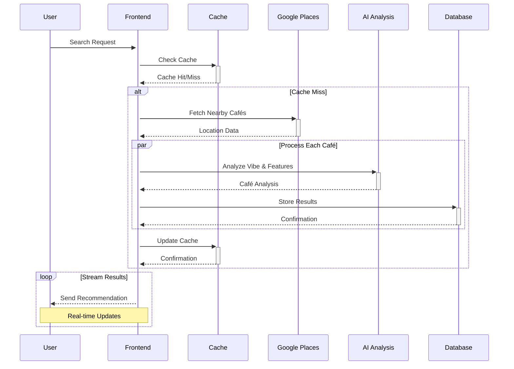

# QuickCafé

<div align="center">

An AI-powered café recommendation engine that finds your perfect café based on mood, preferences, and location.

</div>

## 📚 About

QuickCafé provides café discovery by combining location data with AI-powered analysis of café vibes and amenities. Unlike traditional platforms that only show ratings and reviews, we understand the actual atmosphere and features of each café.

### The Problem
Finding the right café isn't just about location - it's about finding a space that matches your mood and needs. Traditional review platforms don't capture the "vibe" or specific amenities you're looking for.

### Our Solution
QuickCafé uses GPT-4 to analyze café reviews and details to understand their unique characteristics and match them to your preferences. Our system employs:
- Direct review analysis using GPT-4
- Smart scoring algorithms
- Real-time streaming responses
- Location-based caching

## ✨ Core Features

- 🎯 **Smart Matching**: AI-powered analysis of café vibes and amenities
- 📍 **Location-Aware**: Find cafés within 5km of your location
- 💰 **Price Filtering**: Filter by price range ($-$$$)
- 🎨 **Vibe Matching**: Match cafés to your current mood
- ⚡ **Real-Time**: Streaming updates as matches are found
- 🔄 **Smart Caching**: Location-based caching for faster results

## 🏗 System Architecture

### Frontend (SvelteKit + TailwindCSS)

1. **State Management**
```typescript
// Custom store for streaming recommendations
const createRecommendationStore = () => {
  const { subscribe, set, update } = writable<Recommendation[]>([]);
  return {
    subscribe,
    append: (rec: Recommendation) => update(recs => [...recs, rec]),
    clear: () => set([]),
    updateScore: (id: string, score: number) => 
      update(recs => recs.map(r => 
        r.id === id ? { ...r, score } : r
      ))
  };
};
```

2. **UI Configuration**
```javascript
// tailwind.config.js
module.exports = {
  theme: {
    extend: {
      colors: {
        primary: { /* Custom color palette */ },
        vibe: { /* Mood-based colors */ }
      },
      animation: {
        'stream-in': 'streamIn 0.3s ease-out'
      }
    }
  }
}
```

### Backend Infrastructure

1. **Database Schema**
```sql
-- Core Tables
CREATE TABLE cafes (
    id UUID PRIMARY KEY DEFAULT uuid_generate_v4(),
    google_place_id TEXT UNIQUE NOT NULL,
    name TEXT NOT NULL,
    location POINT NOT NULL,
    price_level TEXT,
    operating_hours JSONB,
    created_at TIMESTAMP WITH TIME ZONE DEFAULT NOW(),
    updated_at TIMESTAMP WITH TIME ZONE DEFAULT NOW(),
    CONSTRAINT valid_price_level CHECK (price_level IN ('$', '$$', '$$$', '$$$$'))
);

-- Indexes for Performance
CREATE INDEX idx_cafes_location ON cafes USING GIST (location);
CREATE INDEX idx_cafes_price ON cafes (price_level);

-- Vibe Tracking
CREATE TABLE cafe_vibes (
    cafe_id UUID REFERENCES cafes(id) ON DELETE CASCADE,
    vibe_category TEXT NOT NULL,
    confidence_score FLOAT NOT NULL,
    analyzed_at TIMESTAMP WITH TIME ZONE DEFAULT NOW(),
    PRIMARY KEY (cafe_id, vibe_category),
    CONSTRAINT valid_confidence CHECK (confidence_score BETWEEN 0 AND 1)
);

-- Amenity Tracking
CREATE TABLE cafe_amenities (
    cafe_id UUID REFERENCES cafes(id) ON DELETE CASCADE,
    amenity TEXT NOT NULL,
    confidence_score FLOAT NOT NULL,
    analyzed_at TIMESTAMP WITH TIME ZONE DEFAULT NOW(),
    PRIMARY KEY (cafe_id, amenity),
    CONSTRAINT valid_confidence CHECK (confidence_score BETWEEN 0 AND 1)
);
```

2. **Caching System**
```typescript
class GeospatialCache {
  private readonly TTL = 24 * 60 * 60; // 24 hours
  private readonly PRECISION = 4; // 4 decimal places ≈ 11m precision

  async get(key: CacheKey): Promise<CachedResult | null> {
    const formattedKey = this.formatKey(key);
    const cached = await redis.get(formattedKey);
    return this.processCache(cached);
  }

  async set(key: CacheKey, value: any): Promise<void> {
    const formattedKey = this.formatKey(key);
    await redis.set(formattedKey, JSON.stringify({
      data: value,
      timestamp: Date.now(),
      version: CACHE_VERSION
    }), 'EX', this.TTL);
  }
}
```

### Data Flow & Processing



### How it Works

1. **User Request**
   - User submits preferences (mood, location, price)
   - Frontend initiates search process

2. **Cache Check**
   - System checks Redis cache for nearby recommendations
   - Uses geospatial indexing for fast lookups

3. **Data Gathering**
   - If cache miss, fetches café data from Google Places
   - Processes each café in parallel for efficiency

4. **AI Analysis**
   - Analyzes café data using GPT-4
   - Extracts vibes, features, and best-for scenarios

5. **Result Streaming**
   - Streams recommendations as they're processed
   - Updates UI in real-time with new matches

## 🔑 Environment Variables

Required API keys and configurations:

```env
GOOGLE_PLACES_API_KEY=   # For location data
OPENAI_API_KEY=         # For AI analysis
UPSTASH_REDIS_URL=      # For caching
SUPABASE_URL=          # Database URL
SUPABASE_KEY=          # Database access key
```

## 💻 Development

```bash
# Start development server
npm run dev

# Build for production
npm run build

# Preview production build
npm run preview

# Run linting
npm run lint
```

## 🤝 Contributing

1. Fork the repository
2. Create a feature branch
3. Make your changes
4. Submit a pull request

Please ensure your PR:
- Follows the existing code style
- Includes appropriate documentation
- Has meaningful commit messages

## 📝 License

MIT License - see LICENSE for details

---

Made with ☕ by [Yashmit Singh](https://github.com/yashmit07)
