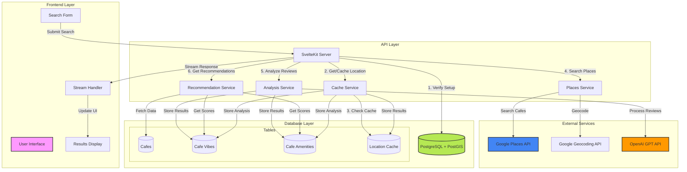

# QuickCafé

QuickCafé is an AI-powered café discovery platform that helps users find the perfect coffee spot based on their preferences. By combining OpenAI's GPT API for intelligent analysis, Google Places API for real café data, and PostGIS for location-based searching, it delivers personalized café suggestions with detailed atmosphere and amenity analysis.

## Features

- 🎯 Intelligent café matching based on:
  - Mood preferences (cozy, modern, quiet, lively, artistic, traditional, industrial)
  - Required amenities (WiFi, outdoor seating, power outlets, etc.)
  - Price range preferences ($, $$, $$$)
  - Location proximity with configurable radius
- 📍 Location-aware recommendations using:
  - Google Geocoding API for address to coordinates conversion
  - PostGIS for efficient geographical queries
  - Location caching to minimize API calls
- 🤖 AI-powered analysis using OpenAI GPT-3.5:
  - Review analysis for vibe detection
  - Amenity identification from reviews
  - Confidence scoring for reliable results
- 🔄 Real-time data streaming with server-sent events
- 🎨 Modern, responsive UI with TailwindCSS
- ⚡ High-performance database queries with PostGIS spatial indexing
- 🧠 Smart scoring system for café ranking based on multiple factors

## System Architecture

### High-Level Overview



### Component Details

#### 1. Frontend Layer
- **User Interface**: Modern SvelteKit application with TailwindCSS
- **Search Form**: Handles user inputs for:
  - Location (required)
  - Mood (required)
  - Price Range (optional)
  - Requirements (optional)
- **Stream Handler**: Processes server-sent events for real-time updates
- **Results Display**: Renders cafe recommendations with animations

#### 2. API Layer
- **SvelteKit Server**: Main application server handling:
  - Request validation
  - Response streaming
  - Error handling
  - Service orchestration

- **Cache Service**: Manages multiple caching strategies:
  - Location caching (24-hour TTL)
  - Analysis results (24-hour TTL)
  - In-memory caching for frequent requests
  - Database-backed persistence

- **Places Service**: Handles external API interactions:
  - Geocoding addresses
  - Searching nearby cafes
  - Fetching place details
  - Review retrieval
  - Error handling and rate limiting

- **Analysis Service**: Processes cafe data:
  - Review text preprocessing
  - OpenAI API integration
  - Score normalization
  - Confidence thresholding
  - Result caching

- **Recommendation Service**: Implements ranking algorithm:
  - Multi-factor scoring
  - Distance calculation
  - Price compatibility
  - Vibe matching
  - Amenity verification

#### 3. External Services
- **Google Places API**:
  - Nearby Search: 5km radius, type=cafe
  - Place Details: reviews, photos, attributes
  - Rate limit: 100 QPS
  
- **Google Geocoding API**:
  - Address to coordinates conversion
  - Rate limit: 50 QPS
  
- **OpenAI GPT API**:
  - Model: gpt-3.5-turbo
  - Context: 3 reviews, 150 chars each
  - Temperature: 0.7
  - Max tokens: 300

#### 4. Database Layer
- **PostgreSQL 13+ with PostGIS**:
  - Spatial indexing
  - Geographic calculations
  - Array column optimization
  - Full-text search capabilities

- **Tables**:
  ```mermaid
  erDiagram
      cafes ||--o{ cafe_vibes : has
      cafes ||--o{ cafe_amenities : has
      cafes {
          uuid id PK
          text google_place_id UK
          text name
          geography location
          text address
          price_level price_level
          timestamptz created_at
          timestamptz updated_at
      }
      cafe_vibes {
          uuid cafe_id FK
          vibe_category[] vibe_categories
          float[] confidence_scores
          timestamptz last_analyzed
      }
      cafe_amenities {
          uuid cafe_id FK
          amenity_type[] amenities
          float[] confidence_scores
          timestamptz last_analyzed
      }
      location_cache {
          text address PK
          geography coordinates
          timestamptz created_at
      }
  ```

### Data Flow

1. **Initial Request**:
   ```mermaid
   sequenceDiagram
       participant U as User
       participant S as Server
       participant C as Cache
       participant G as Google APIs
       participant D as Database
       
       U->>S: Submit Search
       S->>C: Check Location Cache
       alt Cache Hit
           C->>D: Get Cached Cafes
       else Cache Miss
           S->>G: Geocode Location
           G->>S: Return Coordinates
           S->>G: Search Nearby Cafes
           G->>S: Return Cafe List
           S->>D: Store Cafes
           S->>C: Cache Location
       end
   ```

2. **Analysis Flow**:
   ```mermaid
   sequenceDiagram
       participant S as Server
       participant A as Analysis Service
       participant O as OpenAI
       participant D as Database
       
       S->>A: Request Analysis
       A->>D: Check Cached Analysis
       alt Cache Hit
           D->>A: Return Cached Results
       else Cache Miss
           A->>O: Process Reviews
           O->>A: Return Scores
           A->>D: Store High Confidence
           A->>D: Update Cache
       end
       A->>S: Return Analysis
   ```

3. **Recommendation Flow**:
   ```mermaid
   sequenceDiagram
       participant S as Server
       participant R as Recommender
       participant D as Database
       participant O as OpenAI
       
       S->>R: Get Recommendations
       R->>D: Fetch Cafe Data
       R->>D: Get Vibe Scores
       R->>D: Get Amenity Scores
       R->>R: Calculate Rankings
       R->>O: Generate Descriptions
       O->>R: Return Descriptions
       R->>S: Stream Results
   ```

### Performance Optimizations

1. **Database**:
   - Spatial indexes on `location` columns
   - B-tree indexes on `google_place_id`
   - Array column optimization
   - Parallel query execution

2. **Caching**:
   - Multi-level caching strategy
   - Automatic cache invalidation
   - Partial result caching
   - Cache warming for popular locations

3. **API Usage**:
   - Batch requests where possible
   - Rate limiting implementation
   - Retry mechanisms
   - Error handling with fallbacks

4. **Query Optimization**:
   - PostGIS function optimization
   - Efficient joins
   - Result limiting
   - Index utilization

## API Integrations

### OpenAI GPT
- Model: GPT-3.5-turbo
- Purpose: Review analysis and scoring
- Configuration:
  - Max tokens: 300
  - Temperature: 0.7
  - Response format: Structured JSON
- Example response:
```json
{
  "vibe_scores": {
    "cozy": 0.5,
    "modern": 0.3,
    "quiet": 0.4
  },
  "amenity_scores": {
    "wifi": 0.8,
    "outdoor_seating": 0.6,
    "food_menu": 0.9
  }
}
```

### Google Places API
- Services used:
  - Places Search API
  - Place Details API
  - Geocoding API
- Features:
  - Nearby café search
  - Review retrieval
  - Address geocoding
  - Place details fetching

## Setup and Installation

### Prerequisites
- Node.js 16+
- PostgreSQL 13+ with PostGIS extension
- API keys for:
  - OpenAI GPT
  - Google Places API
  - Supabase (for database)

### Environment Variables

⚠️ **Security Notice**: Never commit or share your actual API keys or sensitive credentials. Always use environment variables for sensitive data.

1. Create a `.env` file in the root directory
2. Add the following variables with your own values:
```env
# Supabase Configuration
VITE_SUPABASE_URL=https://your-project.supabase.co        # Your Supabase project URL
VITE_SUPABASE_ANON_KEY=your-anon-key                      # Your Supabase anon key

# API Keys (Keep these secret!)
VITE_GOOGLE_PLACES_API_KEY=your-google-places-key         # Get from Google Cloud Console
VITE_OPENAI_API_KEY=your-openai-key                       # Get from OpenAI dashboard
```

#### Security Best Practices:
- Never commit `.env` file to version control
- Add `.env` to your `.gitignore` file
- Use different API keys for development and production
- Regularly rotate your API keys
- Restrict API key permissions to only what's needed
- For production, use secure environment variable management through your hosting platform

#### Getting the API Keys:
1. **Supabase**:
   - Create a project at [supabase.com](https://supabase.com)
   - Find credentials in Project Settings > API

2. **Google Places API**:
   - Create a project in [Google Cloud Console](https://console.cloud.google.com)
   - Enable Places API and create credentials
   - Add restrictions to the API key (HTTP referrers, IP addresses)

3. **OpenAI API**:
   - Sign up at [OpenAI Platform](https://platform.openai.com)
   - Create an API key in the API Keys section
   - Set usage limits to control costs

### Local Development
1. Clone the repository:
```bash
git clone https://github.com/yourusername/QuickCafe.git
cd QuickCafe
```

2. Install dependencies:
```bash
npm install
```

3. Set up the database:
```bash
# Run migrations
npm run db:migrate
```

4. Start the development server:
```bash
npm run dev
```

## Database Migrations

The project includes SQL migrations for:
1. Creating required extensions:
   - uuid-ossp for UUID generation
   - postgis for geographical queries
2. Setting up ENUM types:
   - price_level ('$', '$$', '$$$')
   - vibe_category (cozy, modern, quiet, etc.)
   - amenity_type (wifi, outdoor_seating, etc.)
3. Creating tables with proper indexes:
   - Spatial index on café locations
   - B-tree indexes on foreign keys
4. Defining functions:
   - search_nearby_cafes(lat, lng, radius, price)
   - update_cafe_analysis(id, vibes, amenities)
   - check_extensions()

## Testing

The project includes comprehensive tests:
- Unit tests for core services
- Integration tests for API endpoints
- Mock implementations for:
  - OpenAI API responses
  - Google Places API
  - Geocoding services
- Test coverage for:
  - Recommendation logic
  - Score calculation
  - Data processing
  - Error handling

Run tests with:
```bash
npm test
```

## Performance Considerations

1. **Database Optimization**
   - PostGIS spatial indexes for location queries
   - Efficient array storage for scores
   - Optimized SQL functions
   - Proper indexing on frequently queried columns

2. **API Usage**
   - Minimal token usage in OpenAI calls
   - Selective review analysis (max 3 reviews, 150 chars each)
   - Efficient Google Places API usage
   - Request caching where appropriate

3. **Caching Strategy**
   - Location caching for repeated searches
   - Analysis results caching with 24-hour expiration
   - High-confidence score storage
   - Automatic cache cleanup

4. **Query Optimization**
   - Efficient PostGIS queries
   - Proper use of indexes
   - Optimized joins
   - Result limiting

## Contributing

1. Fork the repository
2. Create a feature branch
3. Commit your changes
4. Push to the branch
5. Create a Pull Request

## License

MIT

## Acknowledgments

- OpenAI for GPT API
- Google for Places API
- PostGIS community
- SvelteKit team
- Supabase team
