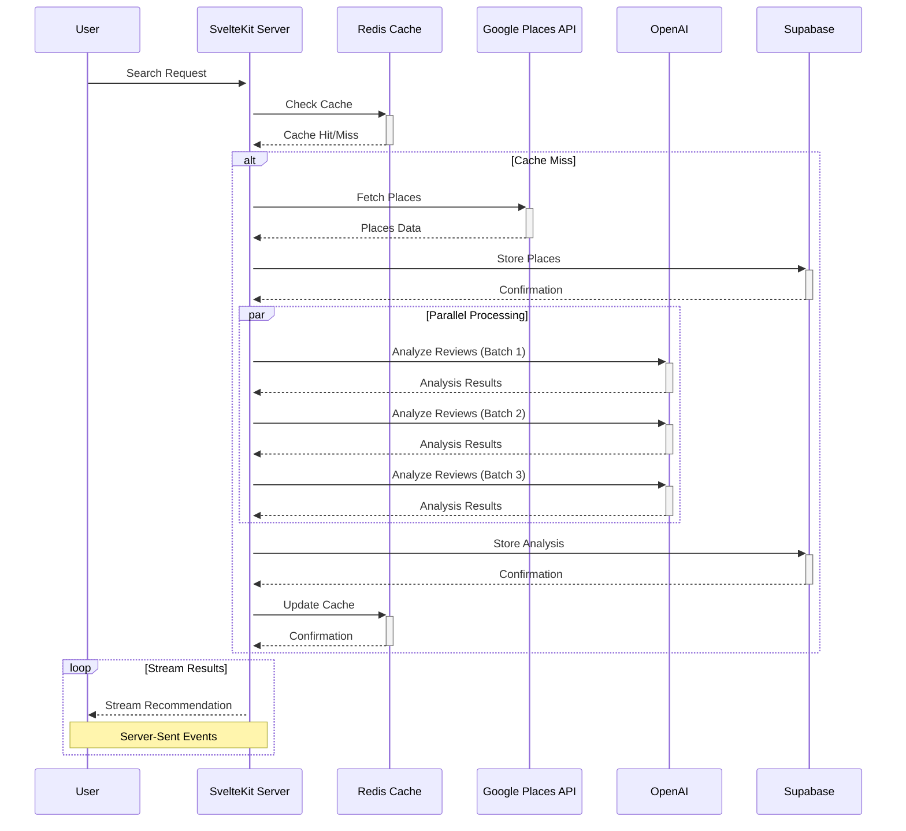

# QuickCafé

<div align="center">

An AI-powered café recommendation engine that finds your perfect café based on mood, preferences, and location.

</div>

## 📚 About

QuickCafé provides café discovery by combining location data with AI-powered analysis of café vibes and amenities. Unlike traditional platforms that only show ratings and reviews, we understand the actual atmosphere and features of each café.

### The Problem
Finding the right café isn't just about location - it's about finding a space that matches your mood and needs. Traditional review platforms don't capture the "vibe" or specific amenities you're looking for.

### Our Solution
QuickCafé uses AI to analyze thousands of reviews and data points to understand café characteristics and match them to your preferences. Our system employs:
- Advanced NLP for review analysis
- Multi-dimensional scoring algorithms
- Real-time data processing
- Intelligent caching mechanisms

## ✨ Core Features

- 🎯 **Smart Matching**: AI-powered analysis of café vibes and amenities
- 📍 **Location-Aware**: Find cafés within 5km of your location
- 💰 **Price Filtering**: Filter by price range ($-$$$)
- 🎨 **Vibe Matching**: Match cafés to your current mood
- ⚡ **Real-Time**: Streaming updates as matches are found
- 🔄 **Smart Caching**: Location-based caching for faster results

## 🏗 System Architecture

### Frontend (SvelteKit + TailwindCSS)

1. **State Management**
```typescript
// Custom store for streaming recommendations
const createRecommendationStore = () => {
  const { subscribe, set, update } = writable<Recommendation[]>([]);
  return {
    subscribe,
    append: (rec: Recommendation) => update(recs => [...recs, rec]),
    clear: () => set([]),
    updateScore: (id: string, score: number) => 
      update(recs => recs.map(r => 
        r.id === id ? { ...r, score } : r
      ))
  };
};
```

2. **UI Configuration**
```javascript
// tailwind.config.js
module.exports = {
  theme: {
    extend: {
      colors: {
        primary: { /* Custom color palette */ },
        vibe: { /* Mood-based colors */ }
      },
      animation: {
        'stream-in': 'streamIn 0.3s ease-out'
      }
    }
  }
}
```

### Backend Infrastructure

1. **Database Schema**
```sql
-- Core Tables
CREATE TABLE cafes (
    id UUID PRIMARY KEY DEFAULT uuid_generate_v4(),
    google_place_id TEXT UNIQUE NOT NULL,
    name TEXT NOT NULL,
    location POINT NOT NULL,
    price_level TEXT,
    operating_hours JSONB,
    created_at TIMESTAMP WITH TIME ZONE DEFAULT NOW(),
    updated_at TIMESTAMP WITH TIME ZONE DEFAULT NOW(),
    CONSTRAINT valid_price_level CHECK (price_level IN ('$', '$$', '$$$', '$$$$'))
);

-- Indexes for Performance
CREATE INDEX idx_cafes_location ON cafes USING GIST (location);
CREATE INDEX idx_cafes_price ON cafes (price_level);

-- Vibe Tracking
CREATE TABLE cafe_vibes (
    cafe_id UUID REFERENCES cafes(id) ON DELETE CASCADE,
    vibe_category TEXT NOT NULL,
    confidence_score FLOAT NOT NULL,
    analyzed_at TIMESTAMP WITH TIME ZONE DEFAULT NOW(),
    PRIMARY KEY (cafe_id, vibe_category),
    CONSTRAINT valid_confidence CHECK (confidence_score BETWEEN 0 AND 1)
);

-- Amenity Tracking
CREATE TABLE cafe_amenities (
    cafe_id UUID REFERENCES cafes(id) ON DELETE CASCADE,
    amenity TEXT NOT NULL,
    confidence_score FLOAT NOT NULL,
    analyzed_at TIMESTAMP WITH TIME ZONE DEFAULT NOW(),
    PRIMARY KEY (cafe_id, amenity),
    CONSTRAINT valid_confidence CHECK (confidence_score BETWEEN 0 AND 1)
);
```

2. **Caching System**
```typescript
class GeospatialCache {
  private readonly TTL = 24 * 60 * 60; // 24 hours
  private readonly PRECISION = 4; // 4 decimal places ≈ 11m precision

  async get(key: CacheKey): Promise<CachedResult | null> {
    const formattedKey = this.formatKey(key);
    const cached = await redis.get(formattedKey);
    return this.processCache(cached);
  }

  async set(key: CacheKey, value: any): Promise<void> {
    const formattedKey = this.formatKey(key);
    await redis.set(formattedKey, JSON.stringify({
      data: value,
      timestamp: Date.now(),
      version: CACHE_VERSION
    }), 'EX', this.TTL);
  }
}
```

### Data Flow & Processing



### API Documentation

#### 1. Recommendation Endpoint
```typescript
/**
 * Get café recommendations based on user preferences
 * @route POST /api/getRecommendation
 * @param {Object} body - Request body
 * @param {string} body.location - Location query (e.g., "San Francisco")
 * @param {VibeCategory} body.mood - Desired café vibe
 * @param {string} [body.priceRange] - Price range filter ("$" to "$$$$")
 * @param {string[]} [body.requirements] - Required amenities
 * @returns {ReadableStream} Stream of recommendations
 */
interface RecommendationRequest {
    location: string;
    mood: VibeCategory;
    priceRange?: string;
    requirements?: string[];
}

interface Recommendation {
    id: string;
    name: string;
    description: string;
    distance: number;
    priceLevel: string;
    vibeScore: number;
    amenityScore: number;
    features: string[];
    bestFor: string[];
}
```

#### 2. Analysis Pipeline
```typescript
/**
 * Review Analysis Pipeline
 * Processes café reviews to extract vibes and amenities
 */
interface ReviewAnalysis {
    type: 'vibe' | 'amenity';
    category: string;
    confidence: number;
    evidence: string[];
}

interface AnalysisPipeline {
    batchSize: number;
    maxConcurrent: number;
    retryAttempts: number;
    confidenceThreshold: number;
}
```

## 🎯 Recommendation Engine

### Core Components

1. **Vibe Scoring (40%)**
```typescript
class VibeScorer {
  private readonly PRIMARY_WEIGHT = 0.7;
  private readonly SECONDARY_WEIGHT = 0.3;

  calculateScore(targetVibe: string, cafeVibes: Map<string, number>): VibeScore {
    const primary = cafeVibes.get(targetVibe) || 0;
    const complementary = this.getComplementaryScore(targetVibe, cafeVibes);

    return {
      primary,
      secondary: complementary,
      final: this.PRIMARY_WEIGHT * primary + this.SECONDARY_WEIGHT * complementary
    };
  }
}
```

2. **Distance Scoring (20%)**
```typescript
class DistanceScorer {
  private readonly MAX_DISTANCE = 5000; // 5km
  private readonly DECAY_FACTOR = 0.5;

  calculateScore(distanceInMeters: number): number {
    if (distanceInMeters > this.MAX_DISTANCE) return 0;
    return Math.exp(-this.DECAY_FACTOR * (distanceInMeters / this.MAX_DISTANCE));
  }
}
```

3. **Price Scoring (10%)**
```typescript
class PriceScorer {
  private readonly EXACT_MATCH = 1.0;
  private readonly ADJACENT_MATCH = 0.3;

  calculateScore(target: string, actual: string): number {
    if (target === actual) return this.EXACT_MATCH;
    return Math.abs(target.length - actual.length) === 1 ? this.ADJACENT_MATCH : 0;
  }
}
```

### Score Aggregation
```typescript
class ScoreAggregator {
  private readonly weights = {
    vibe: 0.4,
    amenity: 0.3,
    distance: 0.2,
    price: 0.1
  };

  calculateFinalScore(scores: {
    vibe: number;
    amenity: number;
    distance: number;
    price: number;
  }): number {
    return Object.entries(this.weights)
      .reduce((total, [key, weight]) => total + (scores[key] * weight), 0);
  }
}
```

## 🚀 Getting Started

### Prerequisites
- Node.js 20.x
- npm
- Required API Keys:
  ```env
  GOOGLE_PLACES_API_KEY=   # Location data
  OPENAI_API_KEY=         # Review analysis
  UPSTASH_REDIS_URL=      # Caching
  SUPABASE_URL=          # Database
  SUPABASE_KEY=          # Auth
  ```

### Quick Start
```bash
# Clone and install
git clone https://github.com/yashmit07/quickcafe.git
cd quickcafe
npm install

# Set up environment
cp .env.example .env
# Add your API keys to .env

# Start development
npm run dev
```

## 🛣 Roadmap

### Current Focus
- [x] Core recommendation engine
- [x] Real-time streaming
- [x] Location-based caching

### Future Plans
- User accounts and preferences
- Social features (sharing, lists)
- Mobile app
- Real-time occupancy tracking
- Table reservations

## 🤝 Contributing

1. Fork the project
2. Create your feature branch (`git checkout -b feature/AmazingFeature`)
3. Commit changes (`git commit -m 'Add AmazingFeature'`)
4. Push to branch (`git push origin feature/AmazingFeature`)
5. Open a Pull Request

### Development Guidelines
- Follow TypeScript best practices
- Add tests for new features
- Update documentation
- Follow existing code style

## 📄 License

Distributed under the MIT License. See `LICENSE` for more information.

---

<div align="center">

Made with ☕ by [Yashmit Singh](https://github.com/yashmit07)

</div>
