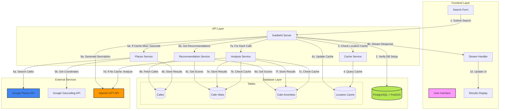
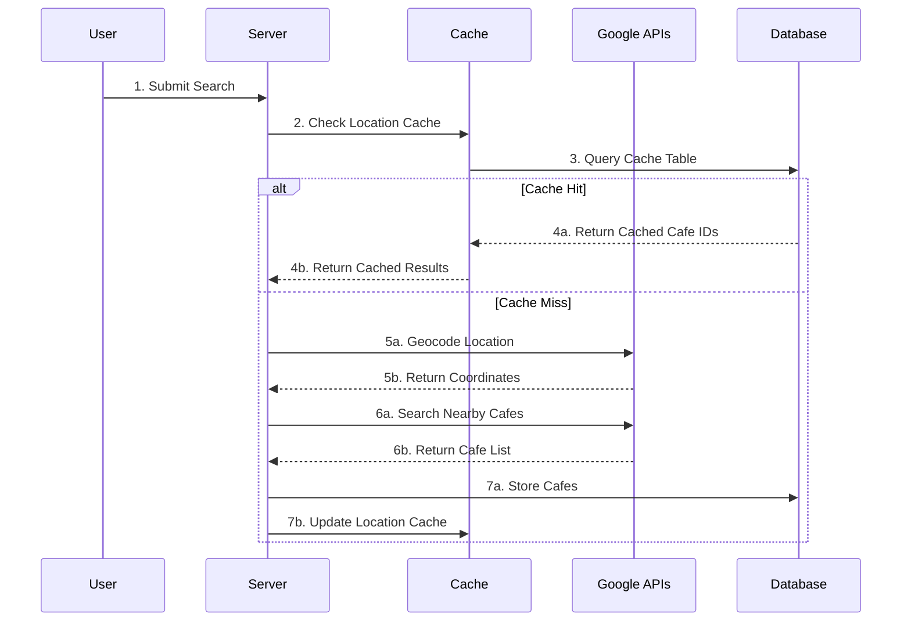
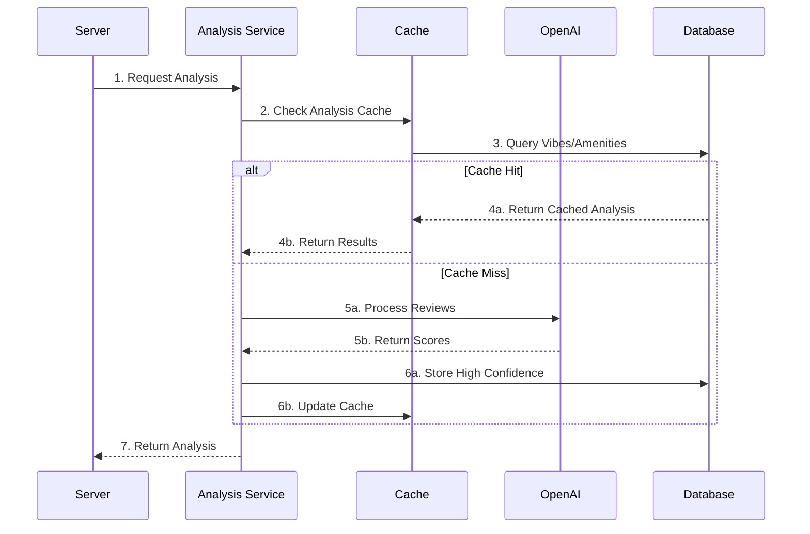
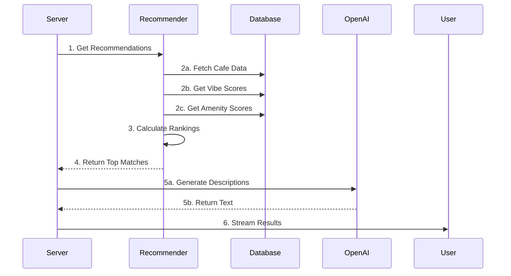

# QuickCafé

QuickCafé is an AI-powered café discovery platform that helps users find the perfect coffee spot based on their preferences. By combining OpenAI's GPT API for intelligent analysis, Google Places API for real café data, and PostGIS for location-based searching, it delivers personalized café suggestions with detailed atmosphere and amenity analysis.

## Features

- 🎯 Intelligent café matching based on:
  - Mood preferences (cozy, modern, quiet, lively, artistic, traditional, industrial)
  - Required amenities (WiFi, outdoor seating, power outlets, etc.)
  - Price range preferences ($, $$, $$$)
  - Location proximity with configurable radius
- 📍 Location-aware recommendations using:
  - Google Geocoding API for address to coordinates conversion
  - PostGIS for efficient geographical queries
  - Location caching to minimize API calls
- 🤖 AI-powered analysis using OpenAI GPT-3.5:
  - Review analysis for vibe detection
  - Amenity identification from reviews
  - Confidence scoring for reliable results
- 🔄 Real-time data streaming with server-sent events
- 🎨 Modern, responsive UI with TailwindCSS
- ⚡ High-performance database queries with PostGIS spatial indexing
- 🧠 Smart scoring system for café ranking based on multiple factors

## System Flow

### Step-by-Step Process

1. **User Input** (Frontend)
   - User enters location (required)
   - Selects mood (required)
   - Optional: price range and requirements
   - Form validates input before submission

2. **Initial Processing** (Server)
   - Validates request parameters
   - Checks database setup
   - Begins recommendation pipeline

3. **Location Processing**
   - Checks location cache (24h TTL)
   - If cache hit: retrieves cached cafe IDs
   - If cache miss:
     a. Geocodes location using Google API
     b. Searches nearby cafes with Google Places API
     c. Stores results in database
     d. Updates location cache

4. **Cafe Analysis**
   - For each cafe:
     a. Checks analysis cache (7d TTL)
     b. If cache miss: Analyzes reviews with OpenAI
     c. Stores high-confidence scores (>0.4 for vibes, >0.5 for amenities)
     d. Updates analysis cache

5. **Recommendation Generation**
   - Fetches cafe data and scores
   - Ranks cafes based on:
     a. Mood match (from vibe scores)
     b. Requirements match (from amenity scores)
     c. Price compatibility
     d. Distance from target location

6. **Response Streaming**
   - Generates natural language descriptions
   - Streams results to frontend
   - Updates UI in real-time

### System Architecture Diagram



### Data Flow Diagrams

1. **Location Processing Flow**:


2. **Analysis Flow**:


3. **Recommendation Flow**:


### Key Components

1. **Frontend Layer**
   - SvelteKit application
   - TailwindCSS styling
   - Server-sent events handler
   - Real-time UI updates

2. **API Layer**
   - Request validation
   - Service orchestration
   - Error handling
   - Response streaming

3. **Services**
   - Places Service: Google API integration
   - Analysis Service: OpenAI integration
   - Cache Service: PostgreSQL-based caching
   - Recommendation Service: Ranking algorithm

4. **Database Layer**
   - PostgreSQL with PostGIS
   - Spatial indexing
   - Cache tables
   - Analysis storage

### Caching Strategy

1. **Location Cache**
   - Key: `{location}:{priceRange}:{radius}`
   - Value: Array of cafe IDs
   - TTL: 24 hours
   - Stored in: PostgreSQL

2. **Analysis Cache**
   - Key: cafe_id
   - Value: High-confidence scores
   - TTL: 7 days
   - Confidence thresholds:
     - Vibes: >0.4
     - Amenities: >0.5

## API Integrations

### OpenAI GPT
- Model: GPT-3.5-turbo
- Purpose: Review analysis and scoring
- Configuration:
  - Max tokens: 300
  - Temperature: 0.7
  - Response format: Structured JSON
- Example response:
```json
{
  "vibe_scores": {
    "cozy": 0.5,
    "modern": 0.3,
    "quiet": 0.4
  },
  "amenity_scores": {
    "wifi": 0.8,
    "outdoor_seating": 0.6,
    "food_menu": 0.9
  }
}
```

### Google Places API
- Services used:
  - Places Search API
  - Place Details API
  - Geocoding API
- Features:
  - Nearby café search
  - Review retrieval
  - Address geocoding
  - Place details fetching

## Setup and Installation

### Prerequisites
- Node.js 16+
- PostgreSQL 13+ with PostGIS extension
- API keys for:
  - OpenAI GPT
  - Google Places API
  - Supabase (for database)

### Environment Variables

1. Create a `.env` file in the root directory
2. Add the following variables with your own values:
```env
# Supabase Configuration
VITE_SUPABASE_URL=https://your-project.supabase.co        # Your Supabase project URL
VITE_SUPABASE_ANON_KEY=your-anon-key                      # Your Supabase anon key

# API Keys (Keep these secret!)
VITE_GOOGLE_PLACES_API_KEY=your-google-places-key         # Get from Google Cloud Console
VITE_OPENAI_API_KEY=your-openai-key                       # Get from OpenAI dashboard
```

#### Getting the API Keys:
1. **Supabase**:
   - Create a project at [supabase.com](https://supabase.com)
   - Find credentials in Project Settings > API

2. **Google Places API**:
   - Create a project in [Google Cloud Console](https://console.cloud.google.com)
   - Enable Places API and create credentials
   - Add restrictions to the API key (HTTP referrers, IP addresses)

3. **OpenAI API**:
   - Sign up at [OpenAI Platform](https://platform.openai.com)
   - Create an API key in the API Keys section
   - Set usage limits to control costs

### Local Development
1. Clone the repository:
```bash
git clone https://github.com/yourusername/QuickCafe.git
cd QuickCafe
```

2. Install dependencies:
```bash
npm install
```

3. Set up the database:
```bash
# Run migrations
npm run db:migrate
```

4. Start the development server:
```bash
npm run dev
```

## Database Migrations

The project includes SQL migrations for:
1. Creating required extensions:
   - uuid-ossp for UUID generation
   - postgis for geographical queries
2. Setting up ENUM types:
   - price_level ('$', '$$', '$$$')
   - vibe_category (cozy, modern, quiet, etc.)
   - amenity_type (wifi, outdoor_seating, etc.)
3. Creating tables with proper indexes:
   - Spatial index on café locations
   - B-tree indexes on foreign keys
4. Defining functions:
   - search_nearby_cafes(lat, lng, radius, price)
   - update_cafe_analysis(id, vibes, amenities)
   - check_extensions()

## Testing

The project includes comprehensive tests:
- Unit tests for core services
- Integration tests for API endpoints
- Mock implementations for:
  - OpenAI API responses
  - Google Places API
  - Geocoding services
- Test coverage for:
  - Recommendation logic
  - Score calculation
  - Data processing
  - Error handling

Run tests with:
```bash
npm test
```

## Performance Considerations

1. **Database Optimization**
   - PostGIS spatial indexes for location queries
   - Efficient array storage for scores
   - Optimized SQL functions
   - Proper indexing on frequently queried columns

2. **API Usage**
   - Minimal token usage in OpenAI calls
   - Selective review analysis (max 3 reviews, 150 chars each)
   - Efficient Google Places API usage
   - Request caching where appropriate

3. **Caching Strategy**
   - Location caching for repeated searches
   - Analysis results caching with 24-hour expiration
   - High-confidence score storage
   - Automatic cache cleanup

4. **Query Optimization**
   - Efficient PostGIS queries
   - Proper use of indexes
   - Optimized joins
   - Result limiting

## Contributing

1. Fork the repository
2. Create a feature branch
3. Commit your changes
4. Push to the branch
5. Create a Pull Request

## License

MIT

## Acknowledgments

- OpenAI for GPT API
- Google for Places API
- PostGIS community
- SvelteKit team
- Supabase team
