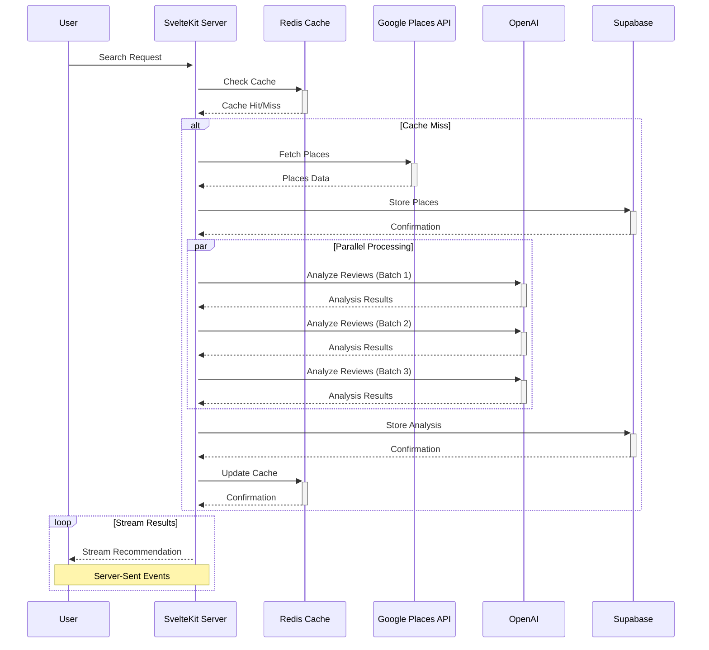

# QuickCafé

<div align="center">

An AI-powered café recommendation engine that finds your perfect café based on mood, preferences, and location.

[Live Demo](https://quickcafe.vercel.app) | [Report Bug](https://github.com/yashmit07/quickcafe/issues) | [Request Feature](https://github.com/yashmit07/quickcafe/issues)

</div>

## 📚 About

QuickCafé revolutionizes café discovery by combining location data with AI-powered analysis of café vibes and amenities. Unlike traditional platforms that only show ratings and reviews, we understand the actual atmosphere and features of each café.

### The Problem
Finding the right café isn't just about location - it's about finding a space that matches your mood and needs. Traditional review platforms don't capture the "vibe" or specific amenities you're looking for.

### Our Solution
QuickCafé uses AI to analyze thousands of reviews and data points to understand café characteristics and match them to your preferences. Our system employs:
- Advanced NLP for review analysis
- Multi-dimensional scoring algorithms
- Real-time data processing
- Intelligent caching mechanisms

## ✨ Core Features

- 🎯 **Smart Matching**: AI-powered analysis of café vibes and amenities
- 📍 **Location-Aware**: Find cafés within 5km of your location
- 💰 **Price Filtering**: Filter by price range ($-$$$)
- 🎨 **Vibe Matching**: Match cafés to your current mood
- ⚡ **Real-Time**: Streaming updates as matches are found
- 🔄 **Smart Caching**: Location-based caching for faster results

## 🏗 System Architecture

### Tech Stack & Design Choices

#### Frontend Architecture
- **SvelteKit**
  - Server-side rendering for optimal performance
  - Progressive enhancement for better UX
  - Hydration strategies for dynamic content
  - Custom stores for state management
  ```typescript
  // Custom store for streaming recommendations
  const createRecommendationStore = () => {
    const { subscribe, set, update } = writable<Recommendation[]>([]);
    return {
      subscribe,
      append: (rec: Recommendation) => update(recs => [...recs, rec]),
      clear: () => set([]),
      updateScore: (id: string, score: number) => 
        update(recs => recs.map(r => 
          r.id === id ? { ...r, score } : r
        ))
    };
  };
  ```

- **TailwindCSS**
  - Custom design system
  - Responsive layout patterns
  - Dynamic theme configuration
  ```javascript
  // tailwind.config.js
  module.exports = {
    theme: {
      extend: {
        colors: {
          primary: { /* Custom color palette */ },
          vibe: { /* Mood-based colors */ }
        },
        animation: {
          'stream-in': 'streamIn 0.3s ease-out'
        }
      }
    }
  }
  ```

#### Backend Infrastructure

1. **Database (Supabase PostgreSQL)**:
   ```sql
   -- Core Tables with Indexes and Constraints
   CREATE TABLE cafes (
       id UUID PRIMARY KEY DEFAULT uuid_generate_v4(),
       google_place_id TEXT UNIQUE NOT NULL,
       name TEXT NOT NULL,
       location POINT NOT NULL,
       price_level TEXT,
       operating_hours JSONB,
       created_at TIMESTAMP WITH TIME ZONE DEFAULT NOW(),
       updated_at TIMESTAMP WITH TIME ZONE DEFAULT NOW(),
       CONSTRAINT valid_price_level CHECK (price_level IN ('$', '$$', '$$$', '$$$$'))
   );

   CREATE INDEX idx_cafes_location ON cafes USING GIST (location);
   CREATE INDEX idx_cafes_price ON cafes (price_level);

   CREATE TABLE cafe_vibes (
       cafe_id UUID REFERENCES cafes(id) ON DELETE CASCADE,
       vibe_category TEXT NOT NULL,
       confidence_score FLOAT NOT NULL,
       analyzed_at TIMESTAMP WITH TIME ZONE DEFAULT NOW(),
       PRIMARY KEY (cafe_id, vibe_category),
       CONSTRAINT valid_confidence CHECK (confidence_score BETWEEN 0 AND 1)
   );

   CREATE INDEX idx_cafe_vibes_score ON cafe_vibes (confidence_score DESC);

   CREATE TABLE cafe_amenities (
       cafe_id UUID REFERENCES cafes(id) ON DELETE CASCADE,
       amenity TEXT NOT NULL,
       confidence_score FLOAT NOT NULL,
       analyzed_at TIMESTAMP WITH TIME ZONE DEFAULT NOW(),
       PRIMARY KEY (cafe_id, amenity),
       CONSTRAINT valid_confidence CHECK (confidence_score BETWEEN 0 AND 1)
   );

   CREATE INDEX idx_cafe_amenities_score ON cafe_amenities (confidence_score DESC);

   -- Trigger for updated_at
   CREATE OR REPLACE FUNCTION update_updated_at_column()
   RETURNS TRIGGER AS $$
   BEGIN
       NEW.updated_at = NOW();
       RETURN NEW;
   END;
   $$ language 'plpgsql';

   CREATE TRIGGER update_cafes_updated_at
       BEFORE UPDATE ON cafes
       FOR EACH ROW
       EXECUTE FUNCTION update_updated_at_column();
   ```

2. **Caching System (Upstash Redis)**:
   ```typescript
   interface CacheKey {
     lat: number;
     lng: number;
     priceRange?: string;
     radius?: number;
   }

   class GeospatialCache {
     private readonly TTL = 24 * 60 * 60; // 24 hours
     private readonly PRECISION = 4; // 4 decimal places ≈ 11m precision

     private formatKey({ lat, lng, priceRange, radius }: CacheKey): string {
       const roundedLat = this.roundCoordinate(lat);
       const roundedLng = this.roundCoordinate(lng);
       return `location:${roundedLat}:${roundedLng}:${priceRange}:${radius}`;
     }

     private roundCoordinate(coord: number): number {
       return Number(coord.toFixed(this.PRECISION));
     }

     async get(key: CacheKey): Promise<CachedResult | null> {
       const formattedKey = this.formatKey(key);
       const cached = await redis.get(formattedKey);
       if (!cached) return null;

       const result = JSON.parse(cached);
       if (this.isExpiredOrInvalid(result)) {
         await redis.del(formattedKey);
         return null;
       }
       return result;
     }

     async set(key: CacheKey, value: any): Promise<void> {
       const formattedKey = this.formatKey(key);
       await redis.set(formattedKey, JSON.stringify({
         data: value,
         timestamp: Date.now(),
         version: CACHE_VERSION
       }), 'EX', this.TTL);
     }
   }
   ```

### Data Flow & Processing



### API Documentation

#### 1. Recommendation Endpoint
```typescript
/**
 * Get café recommendations based on user preferences
 * @route POST /api/getRecommendation
 * @param {Object} body - Request body
 * @param {string} body.location - Location query (e.g., "San Francisco")
 * @param {VibeCategory} body.mood - Desired café vibe
 * @param {string} [body.priceRange] - Price range filter ("$" to "$$$$")
 * @param {string[]} [body.requirements] - Required amenities
 * @returns {ReadableStream} Stream of recommendations
 */
interface RecommendationRequest {
    location: string;
    mood: VibeCategory;
    priceRange?: string;
    requirements?: string[];
}

interface Recommendation {
    id: string;
    name: string;
    description: string;
    distance: number;
    priceLevel: string;
    vibeScore: number;
    amenityScore: number;
    features: string[];
    bestFor: string[];
}
```

#### 2. Analysis Pipeline
```typescript
/**
 * Review Analysis Pipeline
 * Processes café reviews to extract vibes and amenities
 */
interface ReviewAnalysis {
    type: 'vibe' | 'amenity';
    category: string;
    confidence: number;
    evidence: string[];
}

interface AnalysisPipeline {
    batchSize: number;
    maxConcurrent: number;
    retryAttempts: number;
    confidenceThreshold: number;
}
```

## 🎯 Recommendation Engine

### Scoring System

1. **Vibe Scoring (40% weight)**
   ```typescript
   interface VibeScore {
       primary: number;      // Direct mood match (0-1)
       secondary: number;    // Complementary vibes bonus (0.7 weight)
       final: number;       // Combined vibe score
   }

   class VibeScorer {
     private readonly PRIMARY_WEIGHT = 0.7;
     private readonly SECONDARY_WEIGHT = 0.3;

     calculateScore(
       targetVibe: string,
       cafeVibes: Map<string, number>
     ): VibeScore {
       const primary = cafeVibes.get(targetVibe) || 0;
       const complementary = this.getComplementaryScore(
         targetVibe,
         cafeVibes
       );

       return {
         primary,
         secondary: complementary,
         final: this.PRIMARY_WEIGHT * primary +
                this.SECONDARY_WEIGHT * complementary
       };
     }
   }
   ```

2. **Complementary Vibes Map**
   ```typescript
   const vibeRelations = {
       cozy: ['quiet', 'traditional'],
       modern: ['artistic', 'industrial'],
       quiet: ['cozy', 'traditional'],
       lively: ['modern', 'artistic'],
       artistic: ['modern', 'industrial'],
       traditional: ['cozy', 'quiet'],
       industrial: ['modern', 'artistic']
   }

   class ComplementaryVibeScorer {
     private readonly COMPLEMENT_WEIGHT = 0.7;

     getComplementaryScore(
       primaryVibe: string,
       vibes: Map<string, number>
     ): number {
       const complementaryVibes = vibeRelations[primaryVibe] || [];
       return Math.max(
         ...complementaryVibes.map(v => 
           (vibes.get(v) || 0) * this.COMPLEMENT_WEIGHT
         ),
         0
       );
     }
   }
   ```

3. **Distance Scoring**
   ```typescript
   class DistanceScorer {
     private readonly MAX_DISTANCE = 5000; // 5km in meters
     private readonly DECAY_FACTOR = 0.5;

     calculateScore(distanceInMeters: number): number {
       if (distanceInMeters > this.MAX_DISTANCE) return 0;
       return Math.exp(
         -this.DECAY_FACTOR * (distanceInMeters / this.MAX_DISTANCE)
       );
     }
   }
   ```

4. **Price Scoring**
   ```typescript
   class PriceScorer {
     private readonly EXACT_MATCH = 1.0;
     private readonly ADJACENT_MATCH = 0.3;

     calculateScore(
       target: string,
       actual: string
     ): number {
       if (target === actual) return this.EXACT_MATCH;
       
       const targetLevel = target.length;
       const actualLevel = actual.length;
       const difference = Math.abs(targetLevel - actualLevel);
       
       return difference === 1 ? this.ADJACENT_MATCH : 0;
     }
   }
   ```

### Ranking Process

1. **Initial Filtering**
   ```typescript
   interface FilterCriteria {
     location: LatLng;
     maxDistance: number;
     priceRange?: string;
     requiredAmenities: string[];
   }

   class CafeFilter {
     async filter(
       cafes: Cafe[],
       criteria: FilterCriteria
     ): Promise<Cafe[]> {
       return cafes.filter(cafe => 
         this.meetsDistanceCriteria(cafe, criteria.location) &&
         this.meetsPriceCriteria(cafe, criteria.priceRange) &&
         this.meetsAmenityCriteria(cafe, criteria.requiredAmenities)
       );
     }
   }
   ```

2. **Score Aggregation**
   ```typescript
   class ScoreAggregator {
     private readonly weights = {
       vibe: 0.4,
       amenity: 0.3,
       distance: 0.2,
       price: 0.1
     };

     calculateFinalScore(scores: {
       vibe: number;
       amenity: number;
       distance: number;
       price: number;
     }): number {
       return Object.entries(this.weights)
         .reduce((total, [key, weight]) => 
           total + (scores[key] * weight), 0);
     }
   }
   ```

## 🔧 Performance Optimizations

### 1. Caching Strategy
```typescript
interface CacheConfig {
  ttl: number;
  maxSize: number;
  invalidationStrategy: 'lru' | 'ttl' | 'hybrid';
}

class CacheManager {
  private readonly cache: Map<string, CacheEntry>;
  private readonly config: CacheConfig;

  constructor(config: CacheConfig) {
    this.cache = new Map();
    this.config = config;
  }

  async get<T>(key: string): Promise<T | null> {
    const entry = this.cache.get(key);
    if (!entry) return null;

    if (this.isExpired(entry)) {
      this.cache.delete(key);
      return null;
    }

    return entry.data as T;
  }

  private isExpired(entry: CacheEntry): boolean {
    return Date.now() - entry.timestamp > this.config.ttl;
  }
}
```

### 2. Database Optimization
```sql
-- Optimized Query for Café Search
CREATE OR REPLACE FUNCTION search_cafes(
    search_location POINT,
    max_distance_meters INT,
    price_level TEXT = NULL
) RETURNS TABLE (
    id UUID,
    name TEXT,
    distance FLOAT,
    price_level TEXT,
    vibe_scores JSONB,
    amenity_scores JSONB
) AS $$
BEGIN
    RETURN QUERY
    WITH nearby_cafes AS (
        SELECT 
            c.id,
            c.name,
            c.price_level,
            ST_Distance(
                c.location::geography,
                search_location::geography
            ) as distance
        FROM cafes c
        WHERE ST_DWithin(
            c.location::geography,
            search_location::geography,
            max_distance_meters
        )
        AND (price_level IS NULL OR c.price_level = price_level)
    ),
    vibe_aggregation AS (
        SELECT 
            cafe_id,
            jsonb_object_agg(
                vibe_category,
                confidence_score
            ) as vibe_scores
        FROM cafe_vibes
        GROUP BY cafe_id
    ),
    amenity_aggregation AS (
        SELECT 
            cafe_id,
            jsonb_object_agg(
                amenity,
                confidence_score
            ) as amenity_scores
        FROM cafe_amenities
        GROUP BY cafe_id
    )
    SELECT 
        nc.id,
        nc.name,
        nc.distance,
        nc.price_level,
        COALESCE(va.vibe_scores, '{}'::jsonb) as vibe_scores,
        COALESCE(aa.amenity_scores, '{}'::jsonb) as amenity_scores
    FROM nearby_cafes nc
    LEFT JOIN vibe_aggregation va ON nc.id = va.cafe_id
    LEFT JOIN amenity_aggregation aa ON nc.id = aa.cafe_id
    ORDER BY distance;
END;
$$ LANGUAGE plpgsql;
```

## 🚀 Getting Started

### Prerequisites

- Node.js 20.x
- npm
- API Keys:
  - Google Places API (for location data)
  - OpenAI API (for review analysis)
  - Upstash Redis (for caching)
  - Supabase (for database)

### Installation

1. Clone and install dependencies
```bash
git clone https://github.com/yashmit07/quickcafe.git
cd quickcafe
npm install
```

2. Set up environment variables
```bash
cp .env.example .env
```

Required variables:
```env
GOOGLE_PLACES_API_KEY=   # For café data
OPENAI_API_KEY=         # For café analysis
UPSTASH_REDIS_URL=      # For caching
SUPABASE_URL=          # For database
SUPABASE_KEY=          # For database auth
```

3. Start development server
```bash
npm run dev
```

## 🛣 Roadmap

### Current Focus
- [x] Core recommendation engine
- [x] Real-time streaming
- [x] Location-based caching
- [x] Time-based recommendations
- [ ] Photo-based vibe analysis

### Future Plans
- User accounts and preferences
- Social features (sharing, lists)
- Mobile app
- Real-time occupancy tracking
- Table reservations

## 🔧 Performance Optimizations

1. **Caching Strategy**
   - Geospatial indexing for location queries
   - Coordinate rounding for better cache hits
   - 24-hour TTL with manual invalidation
   - Batch processing for analysis

2. **Response Streaming**
   - Server-sent events for real-time updates
   - Progress indicators during analysis
   - Chunked recommendation delivery

3. **Database Optimization**
   - Efficient PostgreSQL queries
   - Indexed location searches
   - Batch inserts for new places

## 🤝 Contributing

1. Fork the project
2. Create your feature branch (`git checkout -b feature/AmazingFeature`)
3. Commit changes (`git commit -m 'Add AmazingFeature'`)
4. Push to branch (`git push origin feature/AmazingFeature`)
5. Open a Pull Request

### Development Guidelines
- Follow TypeScript best practices
- Add tests for new features
- Update documentation
- Follow existing code style

## 📄 License

Distributed under the MIT License. See `LICENSE` for more information.

---

<div align="center">

Made with ☕ by [Yashmit Singh](https://github.com/yashmit07)

</div>
