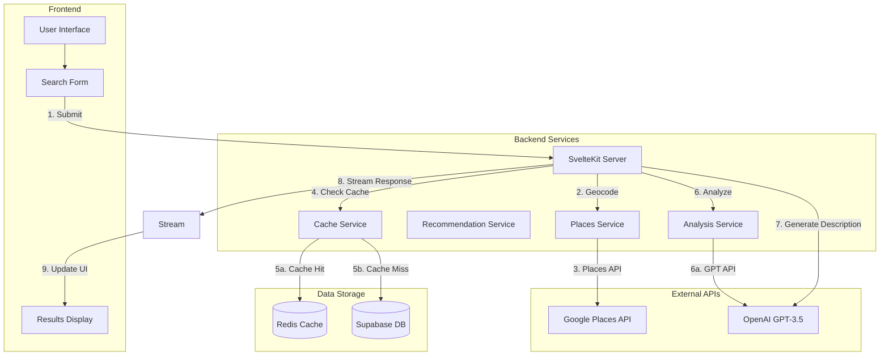
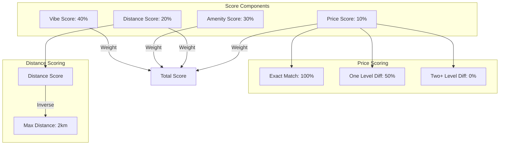
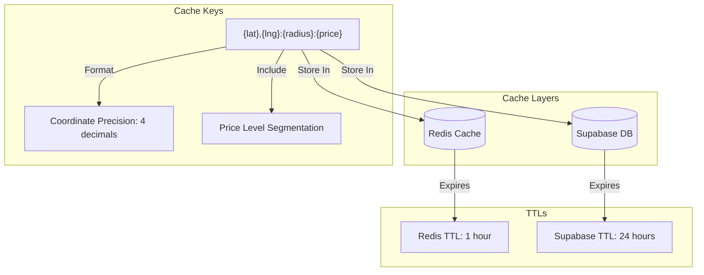

# QuickCafe

A smart café recommendation system that helps users find the perfect café based on their mood, requirements, and location.

## Features

- 🎯 Intelligent café matching based on:
  - Mood preferences (cozy, modern, quiet, lively, artistic, traditional, industrial)
  - Required amenities (WiFi, outdoor seating, power outlets, etc.)
  - Smart price matching (exact match = 100%, one level difference = 50%)
  - Location proximity with weighted scoring
- 📍 Location-aware recommendations using:
  - Google Places Autocomplete for city selection
  - Geocoding API for coordinates conversion
  - PostGIS for efficient geographical queries
  - Coordinate-based caching with 11m precision
- 🤖 AI-powered analysis using OpenAI GPT-3.5:
  - Batch processing for review analysis
  - Parallel processing for better performance
  - Confidence scoring for reliable results
- 💨 High-performance caching system:
  - Redis for fast in-memory caching
  - Supabase for persistent storage
  - Price-aware caching strategy
  - Coordinate-based cache keys
  - Automatic cache invalidation
  - Cache warming for popular locations
- 🔄 Real-time data streaming with server-sent events
- 🎨 Modern, responsive UI with TailwindCSS

## System Architecture

### High-Level Overview



### Database Schema

```sql
-- Core Tables
cafes (
    id UUID PRIMARY KEY,
    google_place_id TEXT UNIQUE,
    name TEXT,
    location GEOGRAPHY(POINT, 4326),
    address TEXT,
    price_level ENUM('$', '$$', '$$$'),
    reviews JSONB[],
    last_review_fetch TIMESTAMPTZ
)

cafe_amenities (
    cafe_id UUID REFERENCES cafes(id),
    amenity ENUM('wifi', 'outdoor_seating', 'power_outlets', 'pet_friendly', 'parking', 'workspace_friendly', 'food_menu'),
    confidence_score DECIMAL(4,3),
    last_analyzed TIMESTAMPTZ
)

cafe_vibes (
    cafe_id UUID REFERENCES cafes(id),
    vibe_category ENUM('cozy', 'modern', 'quiet', 'lively', 'artistic', 'traditional', 'industrial'),
    confidence_score DECIMAL(4,3),
    last_analyzed TIMESTAMPTZ
)

location_cache (
    search_location TEXT PRIMARY KEY,
    cafe_ids UUID[],
    last_updated TIMESTAMPTZ
)
```

### Scoring System



### Caching Strategy



## Setup and Installation

### Prerequisites
- Node.js 20.x (required for deployment)
- PostgreSQL 13+ with PostGIS extension
- Upstash Redis account
- API keys for:
  - OpenAI GPT-3.5
  - Google Places API
  - Supabase
  - Upstash Redis

### Environment Variables

Create a `.env` file with:
```env
# OpenAI API Key
OPENAI_API_KEY=your_openai_key

# Supabase Configuration
PUBLIC_SUPABASE_URL=your_supabase_url
PUBLIC_SUPABASE_ANON_KEY=your_supabase_key

# Redis Configuration
UPSTASH_REDIS_URL=your_redis_url
UPSTASH_REDIS_TOKEN=your_redis_token

# Google Places API
GOOGLE_PLACES_API_KEY=your_google_places_key
PUBLIC_GOOGLE_PLACES_API_KEY=your_google_places_key
```

### Setting Up Redis Cache

1. Create Upstash Account:
   - Visit [upstash.com](https://upstash.com)
   - Sign up for free account
   - Create new database
   - Select closest region
   - Copy REST URL and token

2. Configure Redis:
   - Add environment variables
   - Install Redis client: `npm install @upstash/redis`
   - Redis cache will initialize automatically

### Local Development

1. Install dependencies:
```bash
npm install
```

2. Run database migrations:
```bash
npm run db:migrate
```

3. Start development server:
```bash
npm run dev
```

### Testing

The project includes comprehensive test coverage:

```bash
# Run all tests
npm test

# Run tests with UI
npm run test:ui

# Run coverage report
npm run test:coverage

# Run single test file
npm run test:single
```

### Deployment

The project is configured for deployment on Vercel:

1. Node.js Version:
   - Uses Node.js 20.x (specified in package.json)
   - Configured in `.nvmrc` file
   - Vercel deployment uses this version automatically

2. Adapter Configuration:
   - Uses `@sveltejs/adapter-vercel`
   - Configured for server-side rendering
   - Optimized for edge functions

3. Environment Setup:
   - Add all environment variables in Vercel dashboard
   - Configure project settings if needed
   - Enable automatic deployments from main branch

## Performance Optimizations

1. **Caching System**
   - Two-layer cache architecture
   - Coordinate-based cache keys
   - Price-level segmentation
   - 4-decimal coordinate precision (11m)
   - Automatic cache warming
   - Smart TTL management
   - Efficient cache invalidation

2. **Recommendation Engine**
   - Weighted scoring system:
     - Vibe matching (40%)
     - Amenity matching (30%)
     - Distance scoring (20%)
     - Price matching (10%)
   - Smart price matching:
     - Exact match = 100%
     - One level difference = 50%
     - Two+ levels difference = 0%
   - Distance-based scoring up to 2km

3. **Location Services**
   - Google Places Autocomplete
   - Restricted to US cities
   - Coordinate-based caching
   - Cached geocoding results

4. **Analysis Optimization**
   - Parallel processing
   - Confidence thresholds
   - Selective review analysis
   - Cache reuse

## API Rate Limits

1. **Google Places API**
   - Autocomplete: 100 QPS
   - Places Search: 100 QPS
   - Geocoding: 50 QPS

2. **OpenAI API**
   - GPT-3.5 Turbo: 3000 RPM
   - Batch processing to optimize usage
   - Cached results to minimize calls

3. **Redis Cache**
   - Free tier: 10,000 commands/day
   - 256MB storage
   - Automatic eviction policy

4. **Supabase**
   - Database: 500MB storage
   - Rate limit: 50,000 rows/day
   - Cache table auto-cleanup

## Troubleshooting

1. **Deployment Issues**
   - Ensure Node.js 20.x is specified in package.json
   - Check all environment variables are set in Vercel
   - Verify database migrations have run
   - Check Redis connection is active

2. **Database Issues**
   - Verify PostGIS extension is enabled
   - Check database connection string
   - Ensure all migrations have run
   - Verify table permissions

3. **Cache Issues**
   - Check Redis connection
   - Verify cache keys format
   - Monitor cache hit/miss rates
   - Check TTL settings

## Contributing

1. Fork the repository
2. Create a feature branch
3. Commit your changes
4. Push to the branch
5. Create a Pull Request

## License

MIT

## Acknowledgments

- OpenAI for GPT API
- Google for Places API
- PostGIS community
- SvelteKit team
- Supabase team
