# QuickCafé

An AI-powered café recommendation engine that finds the perfect café based on your mood, preferences, and location.

## 🚀 Quick Start

1. Clone the repository
2. Install dependencies:
```bash
npm install
```
3. Set up environment variables:
```bash
cp .env.example .env
```
Required variables:
```env
GOOGLE_PLACES_API_KEY=   # For café data
OPENAI_API_KEY=         # For café analysis
UPSTASH_REDIS_URL=      # For caching
SUPABASE_URL=          # For database
SUPABASE_KEY=          # For database auth
```

4. Start the development server:
```bash
npm run dev
```

## 🎯 Features

- **Smart Search**: Find cafes based on location, mood, and specific requirements
- **AI Analysis**: Intelligent scoring of café vibes and amenities
- **Real-time Updates**: Stream analysis progress as results come in
- **Fast Results**: Efficient caching for frequently searched locations

## 🏗 System Architecture

### Data Flow

```mermaid
graph TD
    A[Browser] -->|1. Search Request| B[SvelteKit Server]
    B -->|2. Check Cache| C[Redis]
    C -->|3. Cache Hit/Miss| B
    B -->|4. If Cache Miss| D[Google Places API]
    D -->|5. Café Data| B
    B -->|6. Store Cafes| E[Postgres]
    B -->|7. Get/Store Analysis| F[OpenAI API]
    B -->|8. Stream Results| A
```


### Database Schema


## 🔄 Caching System

### Location-based Cache
- **Key Structure**: `location:{lat}:{lng}:{price_range}`
- **Value**: Array of café IDs within 5km radius
- **TTL**: 1 hour
- **Coordinate Rounding**: 4 decimal places for better cache hits

Example:
```typescript
// Cache key for location search
const cacheKey = `location:${roundCoord(lat)}:${roundCoord(lng)}:${priceRange}`

// Cache structure
{
  "location:33.6638:-117.9047:$": [
    "cafe_id_1",
    "cafe_id_2",
    ...
  ]
}
```

## 🎯 Scoring & Recommendation Logic

### 1. Vibe Analysis
```typescript
type VibeScore = {
  cozy: number;      // 0-1 score
  modern: number;    // 0-1 score
  quiet: number;     // 0-1 score
  lively: number;    // 0-1 score
  artistic: number;  // 0-1 score
  traditional: number; // 0-1 score
  industrial: number;  // 0-1 score
}
```

### 2. Amenity Detection
```typescript
type AmenityScore = {
  wifi: number;           // 0-1 score
  outdoor_seating: number; // 0-1 score
  power_outlets: number;   // 0-1 score
  pet_friendly: number;    // 0-1 score
  parking: number;         // 0-1 score
  workspace_friendly: number; // 0-1 score
  food_menu: number;         // 0-1 score
}
```

### 3. Ranking Algorithm
1. **Base Score**: Vibe match percentage (0-100%)
2. **Requirement Multiplier**: Each matched requirement adds 20%
3. **Distance Penalty**: -5% per kilometer from target location
4. **Final Score**: `(baseScore + requirementBonus) * (1 - distancePenalty)`

Example:
```typescript
const finalScore = (
  (vibeMatchScore + (matchedRequirements * 0.2)) * 
  (1 - (distanceKm * 0.05))
).toFixed(2)
```

## 📡 API Reference

### POST /api/getRecommendation
```typescript
interface CafeRequest {
  location: string;     // e.g., "San Francisco, CA"
  mood: VibeCategory;  // "cozy" | "modern" | "quiet" | "lively" | "artistic" | "traditional" | "industrial"
  priceRange?: string; // "$" | "$$" | "$$$"
  requirements?: AmenityType[]; // ["wifi", "outdoor_seating", etc.]
}

interface CafeResponse {
  name: string;
  description: string;
  features: string[];
  bestFor: string;
  distance: number;
  matchScore: number;
}
```

## 🔧 Development

```bash
# Run tests
npm test

# Build for production
npm run build

# Preview production build
npm run preview
```

## 📄 License

MIT
