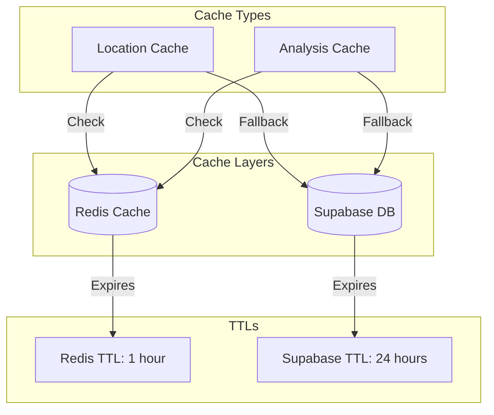

# QuickCafé

QuickCafé is an AI-powered café discovery platform that helps users find the perfect coffee spot based on their preferences. By combining OpenAI's GPT API for intelligent analysis, Google Places API for real café data, and a multi-layer caching system, it delivers personalized café suggestions with detailed atmosphere and amenity analysis.

## Features

- 🎯 Intelligent café matching based on:
  - Mood preferences (cozy, modern, quiet, lively, artistic, traditional, industrial)
  - Required amenities (WiFi, outdoor seating, power outlets, etc.)
  - Price range preferences ($, $$, $$$)
  - Location proximity with 3-mile radius
- 📍 Location-aware recommendations using:
  - Google Places Autocomplete for city selection
  - Geocoding API for coordinates conversion
  - PostGIS for efficient geographical queries
  - Multi-layer location caching
- 🤖 AI-powered analysis using OpenAI GPT-3.5:
  - Batch processing for review analysis
  - Parallel processing for better performance
  - Confidence scoring for reliable results
- 💨 High-performance caching system:
  - Redis for fast in-memory caching
  - Supabase for persistent storage
  - Automatic cache invalidation
  - Cache warming for popular locations
- 🔄 Real-time data streaming with server-sent events
- 🎨 Modern, responsive UI with TailwindCSS

## System Architecture

### High-Level Overview


### Caching Strategy



1. **Redis Cache (Primary)**
   - In-memory caching for fast access
   - 1-hour TTL for all data
   - Used for:
     - Location search results
     - Café analysis results
     - Frequently accessed data

2. **Supabase Cache (Secondary)**
   - Persistent storage for longer retention
   - 24-hour TTL for location cache
   - 7-day TTL for analysis cache
   - Used for:
     - Backup when Redis cache misses
     - Long-term storage of analysis results
     - Historical data retention

### Batch Processing


## Setup and Installation

### Prerequisites
- Node.js 16+
- PostgreSQL 13+ with PostGIS extension
- Upstash Redis account
- API keys for:
  - OpenAI GPT
  - Google Places API
  - Supabase
  - Upstash Redis

### Environment Variables

Create a `.env` file with:
```env
# Supabase Configuration
PUBLIC_SUPABASE_URL=your_supabase_url
PUBLIC_SUPABASE_ANON_KEY=your_supabase_key

# API Keys
GOOGLE_PLACES_API_KEY=your_google_places_key
OPENAI_API_KEY=your_openai_key

# Redis Configuration
UPSTASH_REDIS_URL=your_redis_url
UPSTASH_REDIS_TOKEN=your_redis_token
```

### Setting Up Redis Cache

1. Create Upstash Account:
   - Visit [upstash.com](https://upstash.com)
   - Sign up for free account
   - Create new database
   - Select closest region
   - Copy REST URL and token

2. Configure Redis:
   - Add environment variables
   - Install Redis client: `npm install @upstash/redis`
   - Redis cache will initialize automatically

### Local Development

1. Install dependencies:
```bash
npm install
```

2. Run database migrations:
```bash
npm run db:migrate
```

3. Start development server:
```bash
npm run dev
```

## Performance Optimizations

1. **Caching System**
   - Two-layer cache architecture
   - Automatic cache warming
   - Smart TTL management
   - Efficient cache invalidation

2. **Batch Processing**
   - Process reviews in batches of 3
   - Parallel analysis within batches
   - Efficient resource utilization
   - Better rate limit handling

3. **Location Services**
   - Google Places Autocomplete
   - Restricted to US cities
   - 3-mile search radius
   - Cached geocoding results

4. **Analysis Optimization**
   - Parallel processing
   - Confidence thresholds
   - Selective review analysis
   - Cache reuse

## API Rate Limits

1. **Google Places API**
   - Autocomplete: 100 QPS
   - Places Search: 100 QPS
   - Geocoding: 50 QPS

2. **OpenAI API**
   - GPT-3.5 Turbo: 3000 RPM
   - Batch processing to optimize usage
   - Cached results to minimize calls

3. **Redis Cache**
   - Free tier: 10,000 commands/day
   - 256MB storage
   - Automatic eviction policy

4. **Supabase**
   - Database: 500MB storage
   - Rate limit: 50,000 rows/day
   - Cache table auto-cleanup

## Contributing

1. Fork the repository
2. Create a feature branch
3. Commit your changes
4. Push to the branch
5. Create a Pull Request

## License

MIT

## Acknowledgments

- OpenAI for GPT API
- Google for Places API
- PostGIS community
- SvelteKit team
- Supabase team
